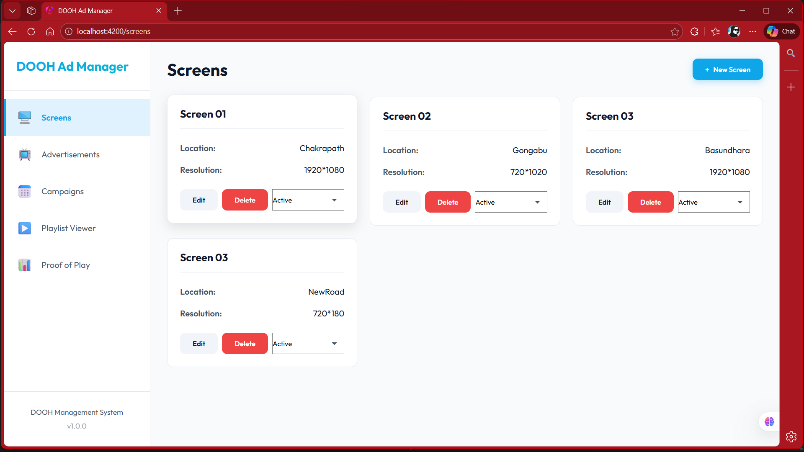
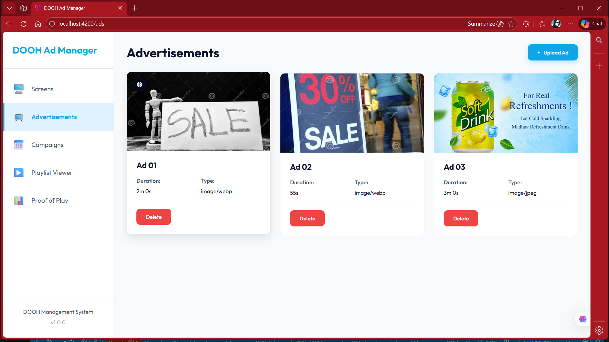
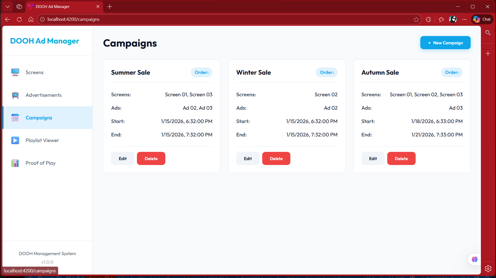
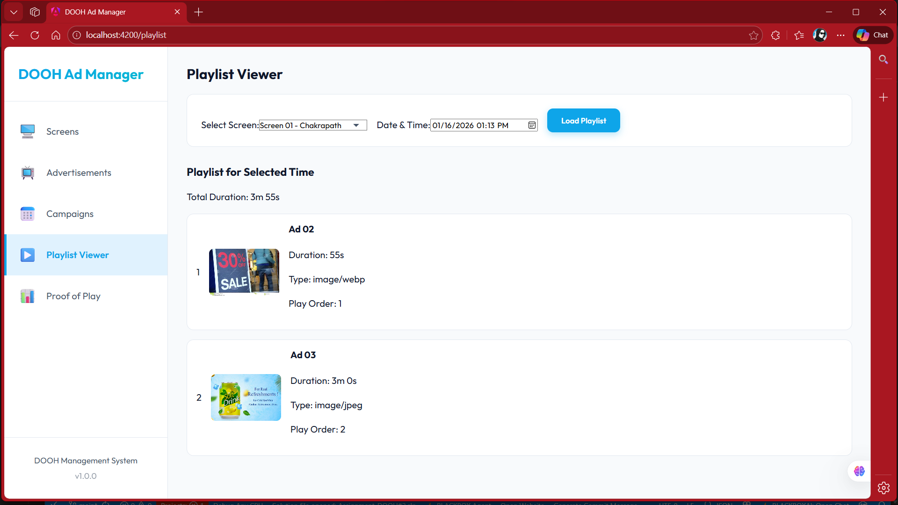

# DOOH Ad Manager

A Digital Out-of-Home (DOOH) advertisement management system that allows operators to manage digital screens, schedule campaigns, and track ad playback.

## 📋 Summary

This system enables operators to:
- **Manage digital display screens** across multiple locations with status tracking
- **Upload and organize advertisement media** assets (images and videos)
- **Schedule campaigns** to play specific ads on selected screens during defined time windows
- **Retrieve playlists** for individual screens based on active campaigns at any given time
- **Track proof of play** for ad playback verification

### Key Features
✅ Screen management with real-time status updates (Active/Offline/Maintenance)  
✅ Media file upload with automatic metadata extraction  
✅ Campaign scheduling with time-based activation  
✅ Playlist API for screen devices  
✅ Proof of Play tracking  
✅ Responsive Angular web interface  
✅ RESTful API with Swagger documentation  

---

## 🏗️ System Architecture

### Tech Stack

**Backend:**
- ASP.NET Core 10.0 (Web API)
- Entity Framework Core 10.0
- PostgreSQL 14+
- Swagger/OpenAPI for API documentation

**Frontend:**
- Angular 18 (Standalone Components)
- RxJS for state management
- Responsive CSS with modern design
- TypeScript 5.4

**Storage:**
- Local filesystem (`wwwroot/uploads/`) for media files
- PostgreSQL for relational data

### Database Schema

```
┌─────────────────┐
│     Screen      │
├─────────────────┤
│ Id (PK)         │
│ Name            │
│ Location        │
│ Status          │
│ Resolution      │
│ Orientation     │
└─────────────────┘
         │
         │ 1:N
         ▼
┌─────────────────┐      ┌─────────────────┐
│ CampaignScreen  │◄────►│    Campaign     │
├─────────────────┤      ├─────────────────┤
│ ScreenId (FK)   │      │ Id (PK)         │
│ CampaignId (FK) │      │ Name            │
└─────────────────┘      │ StartTime       │
                         │ EndTime         │
                         │ PlayOrder       │
                         └─────────────────┘
                                  │
                                  │ 1:N
                                  ▼
                         ┌─────────────────┐      ┌─────────────────┐
                         │   CampaignAd    │◄────►│       Ad        │
                         ├─────────────────┤      ├─────────────────┤
                         │ CampaignId (FK) │      │ Id (PK)         │
                         │ AdId (FK)       │      │ Title           │
                         │ PlayOrder       │      │ MediaUrl        │
                         └─────────────────┘      │ DurationSeconds │
                                                   │ MediaType       │
                                                   │ FileSize        │
                                                   │ CreatedAt       │
                                                   └─────────────────┘
                                                            │
                                                            │
                                                            ▼
                                                   ┌─────────────────┐
                                                   │  ProofOfPlay    │
                                                   ├─────────────────┤
                                                   │ Id (PK)         │
                                                   │ ScreenId (FK)   │
                                                   │ AdId (FK)       │
                                                   │ PlayedAt        │
                                                   └─────────────────┘
```

---

## 🚀 Setup Instructions

### Prerequisites
- **.NET 10.0 SDK** - [Download](https://dotnet.microsoft.com/download/dotnet/8.0)
- **Node.js 18+** and **npm** - [Download](https://nodejs.org/)
- **PostgreSQL 14+** - [Download](https://www.postgresql.org/download/)
- **Git** - [Download](https://git-scm.com/)

### 1️⃣ Database Setup

**Create PostgreSQL Database:**
```bash
# Using psql or pgAdmin
createdb -U postgres dooh_db
```

**Or using SQL:**
```sql
CREATE DATABASE dooh_db;
```

### 2️⃣ Backend Setup

**Navigate to backend directory:**
```bash
cd DoohAdManager-Fixed-V3
```

**Configure Database Connection:**

Edit `appsettings.json`:
```json
{
  "ConnectionStrings": {
    "PostgresConnection": "Host=localhost;Database=dooh_db;Username=postgres;Password=your_password_here"
  }
}
```

**Restore Dependencies:**
```bash
dotnet restore
```

**Run the Backend:**
```bash
dotnet run
```

The API will be available at:
- **API Base URL:** `http://localhost:5085/api`
- **Swagger UI:** `http://localhost:5085/swagger`

**Note:** The database schema will be automatically created on first run using `EnsureCreated()`.

### 3️⃣ Frontend Setup

**Navigate to frontend directory:**
```bash
cd angular-frontend
```

**Install Dependencies:**
```bash
npm install
```

**Configure API URL:**

Edit `src/environments/environment.ts`:
```typescript
export const environment = {
  production: false,
  apiUrl: 'http://localhost:5085/api'
};
```

**Run the Frontend:**
```bash
ng serve
```

The application will be available at:
- **Web UI:** `http://localhost:4200`

---
## 📸 Application Screenshots

### Screens Management


### Advertisements


### Campaign Scheduling


### Playlist Viewer


### Proof of Play Reports

## 📡 API Documentation

### Base URL
```
http://localhost:5085/api
```

### Authentication
No authentication required (as per assignment specifications)

---

### 🖥️ Screen Management APIs

#### **GET /api/screens**
Get all screens.

**Response: 200 OK**
```json
[
  {
    "id": 1,
    "name": "Mall Entrance Display",
    "location": "Ground Floor, Main Entrance",
    "status": "Active",
    "resolution": "1920x1080",
    "orientation": "Landscape"
  }
]
```

#### **POST /api/screens**
Create a new screen.

**Request Body:**
```json
{
  "name": "Mall Entrance Display",
  "location": "Ground Floor, Main Entrance",
  "status": "Active",
  "resolution": "1920x1080",
  "orientation": "Landscape"
}
```

**Response: 201 Created**
```json
{
  "id": 1,
  "name": "Mall Entrance Display",
  "location": "Ground Floor, Main Entrance",
  "status": "Active",
  "resolution": "1920x1080",
  "orientation": "Landscape"
}
```

#### **PUT /api/screens/{id}**
Update an existing screen.

**Request Body:**
```json
{
  "name": "Updated Screen Name",
  "location": "New Location",
  "status": "Maintenance",
  "resolution": "3840x2160",
  "orientation": "Portrait"
}
```

**Response: 200 OK**

#### **DELETE /api/screens/{id}**
Delete a screen.

**Response: 200 OK**

---

### 📺 Advertisement Management APIs

#### **GET /api/ads**
Get all advertisements.

**Response: 200 OK**
```json
[
  {
    "id": 1,
    "title": "Summer Sale Promo",
    "mediaUrl": "/uploads/summer-sale.mp4",
    "durationSeconds": 30,
    "mediaType": "video/mp4",
    "fileSize": 15728640,
    "createdAt": "2026-01-15T10:30:00Z"
  }
]
```

#### **POST /api/ads/upload**
Upload a new advertisement.

**Request: multipart/form-data**
- `file`: Media file (image or video)
- `title`: Advertisement title
- `durationSeconds`: Playback duration in seconds

**Example using cURL:**
```bash
curl -X POST "http://localhost:5085/api/ads/upload" \
  -F "file=@/path/to/ad.mp4" \
  -F "title=Summer Sale" \
  -F "durationSeconds=30"
```

**Response: 201 Created**
```json
{
  "id": 1,
  "title": "Summer Sale Promo",
  "mediaUrl": "/uploads/ad_20260115_103000.mp4",
  "durationSeconds": 30,
  "mediaType": "video/mp4",
  "fileSize": 15728640,
  "createdAt": "2026-01-15T10:30:00Z"
}
```

#### **DELETE /api/ads/{id}**
Delete an advertisement.

**Response: 200 OK**

---

### 📅 Campaign Management APIs

#### **GET /api/campaigns**
Get all campaigns with their associated screens and ads.

**Response: 200 OK**
```json
[
  {
    "id": 1,
    "name": "Summer Campaign",
    "startTime": "2026-06-01T00:00:00Z",
    "endTime": "2026-08-31T23:59:59Z",
    "playOrder": 1,
    "campaignScreens": [
      {
        "screenId": 1,
        "screen": {
          "id": 1,
          "name": "Mall Entrance Display",
          "location": "Ground Floor"
        }
      }
    ],
    "campaignAds": [
      {
        "adId": 1,
        "playOrder": 1,
        "ad": {
          "id": 1,
          "title": "Summer Sale Promo",
          "durationSeconds": 30
        }
      }
    ]
  }
]
```

#### **POST /api/campaigns**
Create a new campaign.

**Request Body:**
```json
{
  "name": "Summer Campaign",
  "startTime": "2026-06-01T00:00:00Z",
  "endTime": "2026-08-31T23:59:59Z",
  "playOrder": 1,
  "screenIds": [1, 2],
  "adIds": [1, 2, 3]
}
```

**Response: 201 Created**
```json
{
  "id": 1,
  "name": "Summer Campaign",
  "startTime": "2026-06-01T00:00:00Z",
  "endTime": "2026-08-31T23:59:59Z",
  "playOrder": 1,
  "campaignScreens": [...],
  "campaignAds": [...]
}
```

#### **PUT /api/campaigns/{id}**
Update a campaign.

**Request Body:** Same as POST

**Response: 200 OK**

#### **DELETE /api/campaigns/{id}**
Delete a campaign.

**Response: 200 OK**

---

### 🎵 Playlist API (For Screen Devices)

#### **GET /api/screens/{screenId}/playlist?at={timestamp}**
Get the playlist for a specific screen at a given time.

**Parameters:**
- `screenId` (path): Screen ID
- `at` (query, optional): ISO 8601 timestamp (defaults to current time)

**Example Request:**
```
GET /api/screens/1/playlist?at=2026-07-15T14:30:00Z
```

**Response: 200 OK**
```json
[
  {
    "adId": 1,
    "title": "Summer Sale Promo",
    "mediaUrl": "/uploads/summer-sale.mp4",
    "durationSeconds": 30,
    "mediaType": "video/mp4",
    "playOrder": 1
  },
  {
    "adId": 2,
    "title": "New Product Launch",
    "mediaUrl": "/uploads/product-launch.mp4",
    "durationSeconds": 45,
    "mediaType": "video/mp4",
    "playOrder": 2
  }
]
```

**Logic:**
- Returns only ads from campaigns that are active at the specified time
- Ordered by `playOrder` within campaigns
- Returns empty array if no active campaigns

---

### 📊 Proof of Play APIs

#### **POST /api/proofofplay**
Record that an ad was played on a screen.

**Request Body:**
```json
{
  "screenId": 1,
  "adId": 1
}
```

**Response: 200 OK**
```json
{
  "id": 1,
  "screenId": 1,
  "adId": 1,
  "playedAt": "2026-01-15T10:35:00Z"
}
```

#### **GET /api/proofofplay**
Get proof of play records (with optional filters).

**Query Parameters:**
- `screenId` (optional): Filter by screen
- `startDate` (optional): Filter records after this date
- `endDate` (optional): Filter records before this date

**Example:**
```
GET /api/proofofplay?screenId=1&startDate=2026-01-01&endDate=2026-01-31
```

**Response: 200 OK**
```json
[
  {
    "id": 1,
    "screenId": 1,
    "adId": 1,
    "playedAt": "2026-01-15T10:35:00Z",
    "screen": {
      "name": "Mall Entrance Display"
    },
    "ad": {
      "title": "Summer Sale Promo"
    }
  }
]
```

---

## 🎯 Key Assumptions

1. **Time Handling:**
   - All timestamps are stored and handled in UTC
   - Campaign time windows are inclusive (start_time <= t <= end_time)
   - No timezone conversion is performed (client handles local display)

2. **Campaign Overlap:**
   - The system **does not enforce** non-overlapping campaigns on the same screen
   - Multiple campaigns can be active simultaneously on one screen
   - Playlist API returns all applicable ads based on time window

3. **File Storage:**
   - Media files are stored locally in `wwwroot/uploads/`
   - Files are named with timestamp to avoid collisions
   - No file size limits enforced (relies on system limits)

4. **Media Types:**
   - Supports common image formats (JPEG, PNG, GIF, WEBP)
   - Supports common video formats (MP4, WEBM, AVI, MOV)
   - MIME type detected automatically from file

5. **Screen Status:**
   - Status changes are manual (not automatically detected)
   - Status values: "Active", "Offline", "Maintenance"
   - Inactive screens still return playlists (device-side decision)

6. **Play Order:**
   - Lower numbers play first
   - Within a campaign, ads play in sequence
   - Multiple campaigns play based on campaign playOrder

7. **Data Validation:**
   - Basic input validation performed
   - Required fields enforced at model level
   - No complex business rule validation

8. **Authentication:**
   - No authentication implemented (as per assignment)
   - All APIs are publicly accessible
   - Production deployment would require authentication

---

## ⚠️ Known Limitations

### Functional Limitations

1. **No Campaign Overlap Checking:**
   - System does not prevent overlapping campaigns on the same screen
   - Playlist API returns all matching ads without conflict resolution

2. **No Automatic Status Detection:**
   - Screen status must be manually updated
   - No heartbeat or health check mechanism

3. **No Media Transcoding:**
   - Uploaded media is stored as-is
   - No format conversion or optimization

4. **No CDN Integration:**
   - Media served directly from application server
   - Not suitable for high-bandwidth scenarios

5. **Limited Search/Filter:**
   - No advanced search capabilities
   - Basic listing only

### Technical Limitations

1. **Database Migrations:**
   - Uses `EnsureCreated()` instead of proper migrations
   - Not suitable for production schema evolution

2. **File Cleanup:**
   - Deleted ads don't remove associated files
   - Manual cleanup required

3. **Concurrent Uploads:**
   - No queue mechanism for simultaneous uploads
   - May cause issues under high load

4. **Error Handling:**
   - Basic error handling only
   - Some edge cases may not be gracefully handled

5. **No Caching:**
   - All requests hit database
   - No Redis or in-memory caching

6. **No Rate Limiting:**
   - APIs are not rate-limited
   - Vulnerable to abuse

### Scalability Limitations

1. **Single Server:**
   - Application is not horizontally scalable (file storage)
   - Requires load balancer + shared storage for scale-out

2. **Database Connection Pooling:**
   - Uses default EF Core connection pool
   - May need tuning for high concurrency

3. **No Background Jobs:**
   - No worker processes for async tasks
   - All operations are synchronous

---

## 🔍 Design Decisions & Trade-offs

### 1. Database Design

**Decision:** Many-to-many relationships through junction tables

**Rationale:**
- Allows flexible assignment of multiple ads to multiple screens
- Maintains referential integrity
- Enables efficient queries for playlists

**Trade-off:**
- More complex queries
- Additional join tables increase data size

### 2. File Storage

**Decision:** Local filesystem storage

**Rationale:**
- Simple to implement
- No external dependencies
- Suitable for assignment scope
- Easy to debug

**Trade-off:**
- Not suitable for production at scale
- Cannot horizontally scale without shared storage
- No automatic backup/redundancy

### 3. Campaign Time Logic

**Decision:** Time-based filtering in application layer

**Rationale:**
- Clear, readable code
- Easy to test and debug
- PostgreSQL timestamp handling is reliable

**Trade-off:**
- All campaigns loaded into memory for filtering
- Could be optimized with database-level filtering

### 4. API Design

**Decision:** RESTful design with nested resources

**Rationale:**
- Industry standard
- Easy to understand and consume
- Maps well to CRUD operations

**Trade-off:**
- Playlist API returns nested data (could be flatter)
- Some endpoints return more data than minimal

### 5. Frontend State Management

**Decision:** Service-based state with RxJS Observables

**Rationale:**
- Angular best practice
- Reactive data flow
- Easy to manage async operations

**Trade-off:**
- No centralized state store (like NgRx)
- Some state duplication across components

### 6. Error Handling

**Decision:** Middleware-based error handling

**Rationale:**
- Centralized error processing
- Consistent error responses
- Separates concerns

**Trade-off:**
- Generic error messages (less specific)
- Limited error context in responses

---

## 🧪 Testing the Application

### Manual Testing Workflow

**1. Create Screens:**
```bash
# Using Swagger UI or cURL
POST /api/screens
{
  "name": "Screen 01",
  "location": "Mall Entrance",
  "status": "Active",
  "resolution": "1920x1080"
}
```

**2. Upload Ads:**
```bash
POST /api/ads/upload
Form Data:
- file: [video file]
- title: "Summer Sale"
- durationSeconds: 30
```

**3. Create Campaign:**
```bash
POST /api/campaigns
{
  "name": "Summer Promotion",
  "startTime": "2026-06-01T00:00:00Z",
  "endTime": "2026-08-31T23:59:59Z",
  "playOrder": 1,
  "screenIds": [1],
  "adIds": [1, 2]
}
```

**4. Get Playlist:**
```bash
GET /api/screens/1/playlist?at=2026-07-15T10:00:00Z
```

**5. Record Proof of Play:**
```bash
POST /api/proofofplay
{
  "screenId": 1,
  "adId": 1
}
```

### Expected Results

- Screen appears in web UI screens list
- Uploaded video visible in ads list with preview
- Campaign shows linked screens and ads
- Playlist returns ads only if time falls within campaign window
- Proof of play records show in reports

---

## 📂 Project Structure

```
DoohAdManager/
├── DoohAdManager-Fixed-V3/          # Backend (ASP.NET Core)
│   ├── Controllers/
│   │   ├── ScreensController.cs      # Screen CRUD
│   │   ├── AdsController.cs          # Ad upload/management
│   │   ├── CampaignsController.cs    # Campaign scheduling
│   │   ├── PlaylistController.cs     # Playlist API
│   │   └── ProofOfPlayController.cs  # Tracking
│   ├── Data/
│   │   └── ApplicationDbContext.cs   # EF Core context
│   ├── Models/
│   │   ├── Screen.cs
│   │   ├── Ad.cs
│   │   ├── Campaign.cs
│   │   ├── CampaignScreen.cs
│   │   ├── CampaignAd.cs
│   │   └── ProofOfPlay.cs
│   ├── wwwroot/
│   │   └── uploads/                  # Media storage
│   ├── Program.cs                    # App configuration
│   ├── appsettings.json             # Configuration
│   └── adManager.csproj             # Project file
│
└── angular-frontend/                 # Frontend (Angular)
    ├── src/
    │   ├── app/
    │   │   ├── components/
    │   │   │   ├── screens/
    │   │   │   ├── ads/
    │   │   │   ├── campaigns/
    │   │   │   ├── playlist/
    │   │   │   └── proof-of-play-report/
    │   │   ├── services/
    │   │   │   ├── screen.service.ts
    │   │   │   ├── ad.service.ts
    │   │   │   ├── campaign.service.ts
    │   │   │   └── proof-of-play.service.ts
    │   │   ├── models/
    │   │   │   ├── screen.model.ts
    │   │   │   ├── ad.model.ts
    │   │   │   └── campaign.model.ts
    │   │   ├── app.component.ts
    │   │   └── app.routes.ts
    │   ├── environments/
    │   │   └── environment.ts
    │   └── styles.css
    ├── package.json
    └── angular.json
```

---

## 🐛 Troubleshooting

### Backend Issues

**Problem:** Database connection fails
```
Solution: Check PostgreSQL is running and connection string is correct
$ sudo systemctl status postgresql
```

**Problem:** File upload fails
```
Solution: Ensure wwwroot/uploads directory exists and has write permissions
$ mkdir -p wwwroot/uploads
$ chmod 755 wwwroot/uploads
```

**Problem:** CORS errors in browser
```
Solution: Verify CORS policy in Program.cs includes your frontend URL
```

### Frontend Issues

**Problem:** Cannot connect to API
```
Solution: Check environment.ts has correct API URL and backend is running
```

**Problem:** npm install fails
```
Solution: Clear cache and retry
$ npm cache clean --force
$ rm -rf node_modules package-lock.json
$ npm install
```

**Problem:** Build errors
```
Solution: Ensure Angular CLI and Node.js versions are correct
$ ng version
```

---

## 🚢 Deployment Considerations

### For Production Deployment:

1. **Database:**
   - Use proper migrations instead of `EnsureCreated()`
   - Implement connection pooling tuning
   - Set up backups

2. **File Storage:**
   - Migrate to blob storage (Azure Blob, AWS S3)
   - Implement CDN for media delivery

3. **Security:**
   - Implement authentication (JWT)
   - Add rate limiting
   - Enable HTTPS only
   - Input sanitization

4. **Performance:**
   - Add Redis caching
   - Implement background job processing
   - Database query optimization
   - Add logging and monitoring

5. **Scalability:**
   - Container the application (Docker)
   - Use orchestration (Kubernetes)
   - Load balancing
   - Database read replicas

---

## 📞 Support & Contact

For questions or issues:
- Check API documentation at `/swagger`
- Review this README thoroughly
- Examine code comments for implementation details

---

## 📄 License

This project is developed as part of an assignment and is for educational purposes.

---

## ✅ Completion Checklist

- [x] All required APIs implemented
- [x] Swagger/OpenAPI documentation available
- [x] Database schema with proper relationships
- [x] Web interface for all CRUD operations
- [x] Playlist API with time-based filtering
- [x] Proof of Play tracking
- [x] README with setup instructions
- [x] API examples with request/response
- [x] Key assumptions documented
- [x] Known limitations listed
- [x] Clean, readable code structure
- [x] RESTful API design
- [x] UTC time handling
- [x] Error handling middleware

---

**Version:** 1.0.0  
**Last Updated:** January 16, 2026  
**Author:** [Manish Neupane]